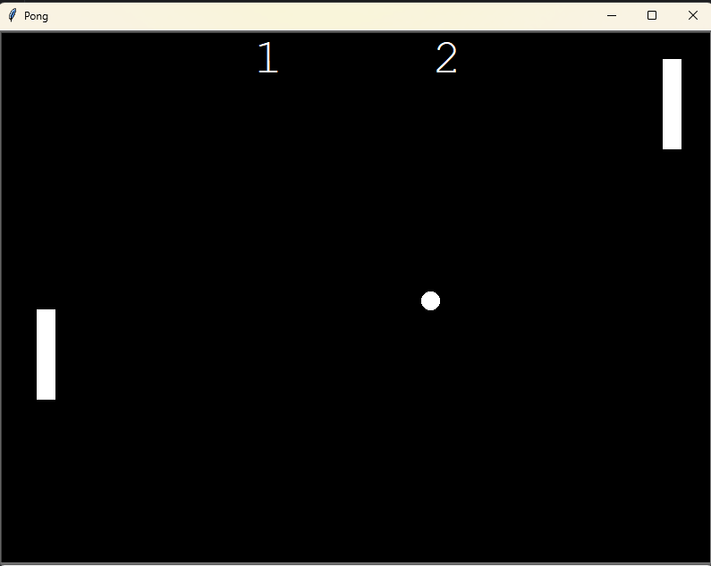

# Python Game Project

This Python projects created using the **Turtle module** and **Object-Oriented Programming (OOP)** concepts.  
These projects are beginner-friendly and focus on logic building and visualization.

---

## Projects Included
- Turtle Graphics Designs
- Arcade Game using Turtle
- OOP-based Python Programs

---

## Technologies Used
- Turtle Module
- Object-Oriented Programming (OOP)
---

**Screenshot**

  

