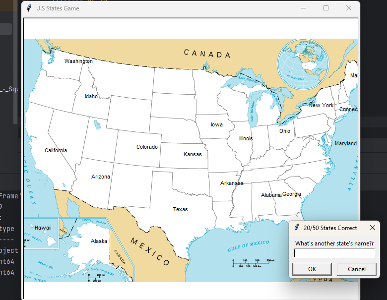

# Python Game Project

This Python projects created using the **Turtle module**, **Object-Oriented Programming (OOP)** and **File-Handling** concepts.  
These projects are beginner-friendly and focus on logic building and visualization.

---

## Projects Included
- Turtle Graphics Designs
- US_states Games using Turtle
- OOP-based Python Programs
- DataFrame using Pandas

---

## Technologies Used
- Turtle Module
- Pandas Module
- Object-Oriented Programming (OOP)
- File-handling
---

**Screenshot**

  

