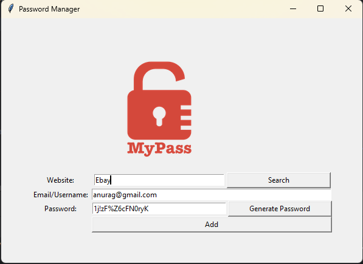

# Password_Project

This Python projects created using the **tkinter module**, **File-Handling** and **Error Handling**concepts.  
These projects are beginner-friendly and focus on logic building and visualization.
This project generates strong, random passwords, saves them securely in a JSON file, and provides functionality 
to retrieve them when needed.

---

## Projects Included
- tkinter Graphics Designs
- Password_project using Turtle
- File Handling
- Error and Exception
---

**Screenshot**

  

